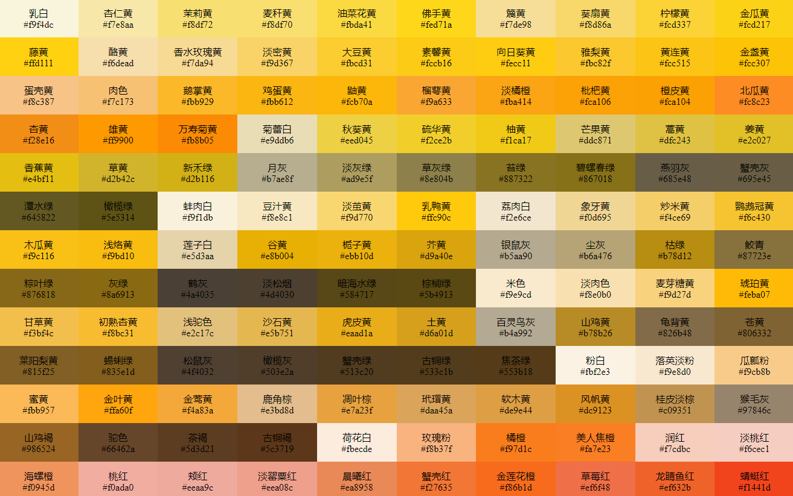

# 色谱 | 中国传统颜色
Perchouli 大佬曾经开发了个 [中国色](http://zhongguose.com/) 网站，该网站颜色参考自中科院 1957 年出版的《色谱》。中国色网站虽制作精美，但是不易大量查阅各种颜色。本项目所有颜色取自中国色网站，在排版上直观列出所有颜色，使查询、取色更加方便。

## 预览

## 相关参考
- [zhongguose － 传统颜色](http://zhongguose.com/)